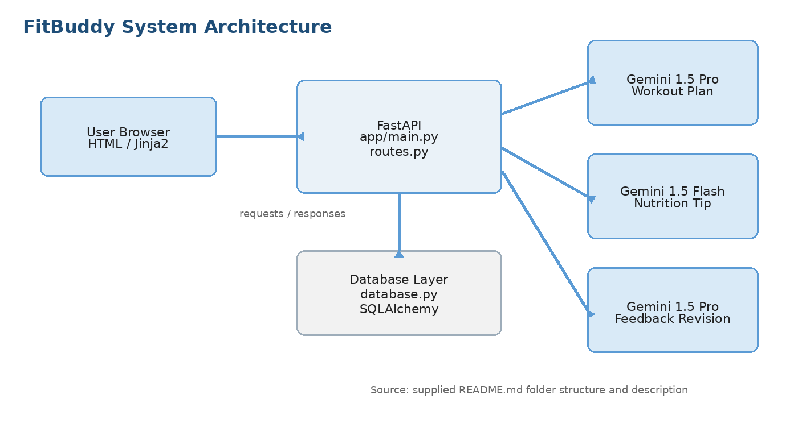

# Solution Architecture

## Request flow
Browser -> FastAPI route (`routes.py`) -> generator / revision module -> Gemini API and/or database (`database.py`) -> Jinja2 template -> browser.

## Components
| Component | File(s) |
|---|---|
| Entry point | `app/main.py` |
| Routes | `app/routes.py` |
| Request models | `app/schemas.py` |
| Workout plan (Gemini 1.5 Pro) | `app/gemini_generator.py` |
| Nutrition tip (Gemini 1.5 Flash) | `app/gemini_flash_generator.py` |
| Plan revision (Gemini 1.5 Pro) | `app/updated_plan.py` |
| Database | `app/database.py` -> `fitbuddy.db` |
| UI | `app/templates/index.html`, `result.html`, `all_users.html` |
